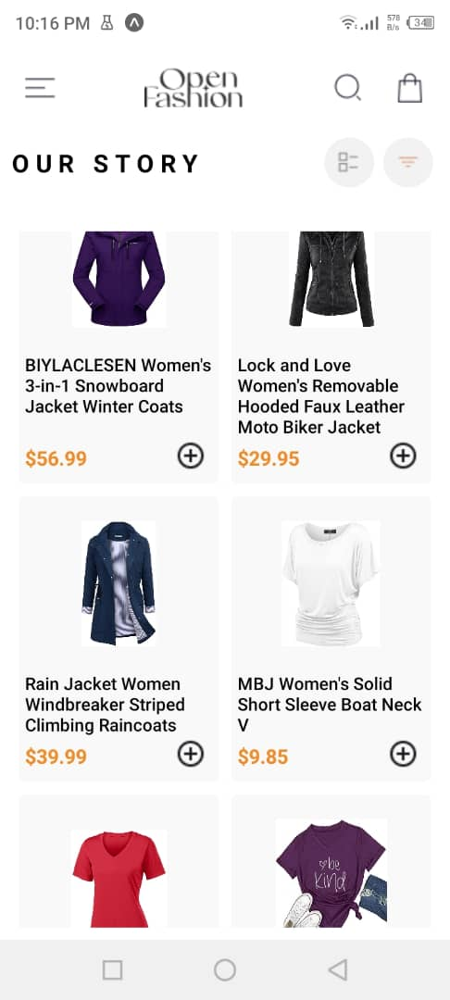

# Shopping App

A React Native mobile application for browsing and purchasing products.

## Features

- Browse a list of products
- View detailed product information
- Add products to cart
- Remove products from cart
- Persistent cart storage
- Drawer navigation

## Components

### 1. HomeScreen
- Displays a list of available products fetched from an external API
- Each product has an "Add to Cart" button

### 2. ProductDetailScreen
- Shows detailed information about a selected product
- Includes an "Add to Cart" button

### 3. CartScreen
- Displays items added to the cart
- Each item has a "Remove from Cart" button

### 4. DrawerNavigator
- Provides easy navigation between screens
- Accessible through a swipe gesture or button

## Technical Details

### API Integration
- Uses `fetch` or `axios` to retrieve product data from an external API
- Implements async/await or Promises for handling asynchronous operations

### State Management
- Utilizes React's built-in state management or a state management library (e.g., Redux, MobX)
- Manages product list, cart items, and current product details

### Local Storage
- Implements AsyncStorage, SecureStore, or FileSystem for persistent storage of cart items on the device

### Navigation
- Uses React Navigation for managing screen transitions and the drawer component

### UI Components
- Utilizes React Native's core components and possibly third-party UI libraries for a polished look and feel

## Usage

1. Open the app to view the list of available products
2. Tap on a product to view its details
3. Use the "Add to Cart" button to add items to your cart
4. Swipe from the left edge or tap the menu button to open the drawer navigation
5. Navigate to the Cart screen to view selected items
6. Use the "Remove from Cart" button to remove items from your cart

## Screenshots

